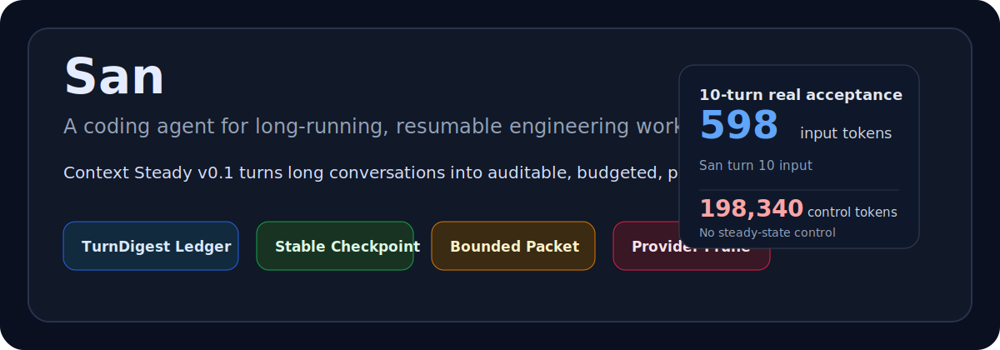
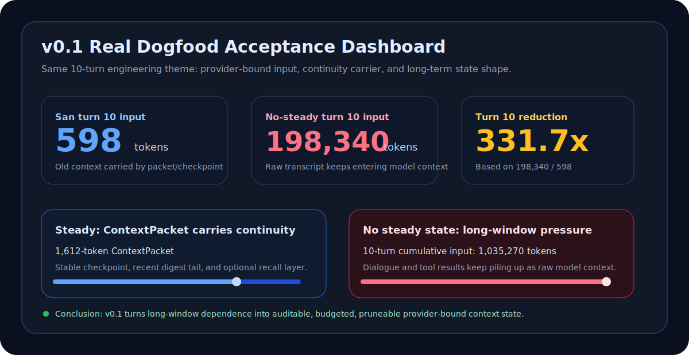
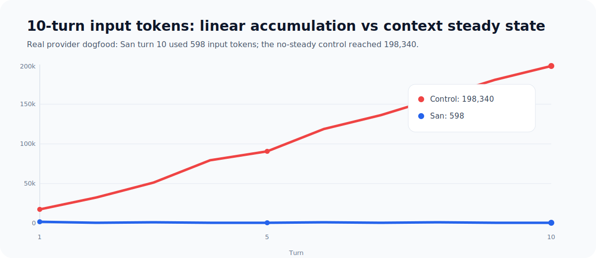
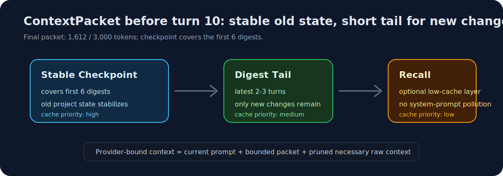

# San

[中文](README.md) | **English**

<p align="center">
  
</p>

<p align="center">
  
  
  = 1.3.14" />
  
</p>

San is a coding agent for long-running, resumable engineering work. It started as a fork of `omp`, keeps the mature tool-driven coding surface, and focuses on a narrower systems problem: after many turns of discussion, code changes, verification, and resume, the agent should still preserve stable, auditable, and compact context state.

San's first public milestone is **San Context Steady v0.1**.

**One-line version**: San does not treat "fit more transcript into a larger window" as the answer. It turns long-running dialogue into an auditable ledger, stable checkpoints, and bounded ContextPackets so model-bound context can reach steady state.

## What You Can See Today

| Result | v0.1 evidence | Why it matters |
| --- | ---: | --- |
| Stable input size | turn 10 at `598 tokens` | provider-bound context no longer grows linearly with raw transcript |
| Lower long-window pressure | control turn 10 at `198,340 tokens` | San moves old context into packet/checkpoint state for the same class of work |
| Recoverable continuity | `1,612-token ContextPacket` | later turns still carry goals, files, decisions, risks, and acceptance criteria |
| Preserved audit trail | `1 checkpoint` covering the first 6 digests | raw session journal stays append-only for resume/debug/audit |

These numbers are not meant to show that one fixed prompt was matched. They show the runtime property San is aiming for: old state becomes structured, model-bound history becomes pruneable, and the next turn can still recover the task context.

**Fast Acceptance Entry Points**:

- **Recommended config**: `san --config packages/coding-agent/examples/config/san-context-steady-recommended.yml`
- **Quality report**: `docs/research/context-steady-v0.1-quality-acceptance-report.html`
- **Core contract test**: `packages/coding-agent/test/context-steady/agent-session-m2.test.ts`
- **Local verification**: `bun check` + `HOME=/private/tmp/san-test-home bun test packages/coding-agent/test/context-steady packages/coding-agent/test/san-loop`

## Why San

Most coding agents work well on short tasks, then degrade as the transcript grows. Three failure modes show up quickly:

- **Context growth**: prior dialogue, tool results, and intermediate reasoning keep accumulating in provider-bound context.
- **Continuity loss**: after compression or resume, the agent can lose important decisions, touched files, risks, and acceptance criteria.
- **Weak auditability**: important state remains buried in raw transcript instead of becoming explicit runtime state.

San treats continuity as a runtime-system problem, not as an ever-longer prompt.

## Context Steady v0.1

San v0.1 introduces a context steady pipeline: each completed agent turn can be distilled into structured state, and later turns can read that state through a bounded ContextPacket.

The v0.1 surface is ready to describe publicly:

- **TurnDigest ledger**: each settled turn can persist a `san.turn_digest` entry with user intent, actions taken, decisions, files touched, risks, next steps, memory candidates, and tool evidence.
- **Stable checkpoints**: older digest history rolls into `san.context_checkpoint` entries so long-lived project state remains available without replaying the full raw transcript.
- **Bounded ContextPackets**: before the next real user prompt, San can inject a `san.context_packet` assembled from stable checkpoints, recent digest tail, and optional recall results under an explicit token budget.
- **Provider payload pruning**: raw transcript spans already covered by ContextPacket evidence can be removed before provider send, reducing linear active-context growth.
- **Optional LLM digesting**: deterministic fallback digests remain available; `san.contextSteady.digest.llm.*` can enable a side LLM to improve semantic digest quality without becoming a hard dependency.
- **Dogfood acceptance baseline**: deterministic verifiers and real 10-turn dogfood artifacts are included to validate whether the system is actually steady, not merely injecting another summary.

### v0.1 Acceptance Evidence

San v0.1 is not validated by checking whether a summary was injected. The acceptance question is whether provider-bound context stops carrying equivalent raw transcript while later turns still preserve task continuity.

The current public report is based on two real 10-turn conversations:

<p align="center">
  
</p>

<p align="center">
  
</p>

| Metric | San Context Steady v0.1 | No San steady-state control |
| --- | ---: | ---: |
| Turn 10 input | 598 tokens | 198,340 tokens |
| 10-turn cumulative input | small window + ContextPacket continuity | 1,035,270 tokens |
| Turn 10 continuity carrier | 1,612-token ContextPacket | large raw-history surface |
| Long-term state | 1 checkpoint covering the first 6 digests | raw transcript keeps accumulating |
| Acceptance result | provider-bound steady-state mechanism is present | long-window pressure, not engineering steady state |

In concrete terms: San's 10th turn needed only 598 input tokens plus a 1,612-token ContextPacket to carry continuity. Under the same 10-turn theme, the control run reached 198,340 input tokens on turn 10. This is the core v0.1 claim: long-context behavior is converted into auditable, budgeted, pruneable context state.

This is not a prompt-specific rule. The acceptance target is a general runtime property: old state becomes structured, model-bound history becomes pruneable, and later turns can still recover files, decisions, risks, and acceptance criteria. In other words, San v0.1 stabilizes how an agent receives context during long engineering tasks.

<p align="center">
  
</p>

The ContextPacket is not just a shorter summary. It separates old state into a stable layer, keeps new changes in a short tail, and places optional recall in a low-cache layer. Later turns keep access to prior conclusions without repeatedly carrying the same raw transcript in provider-bound payloads.

Evidence sources:

- Quality acceptance report: `docs/research/context-steady-v0.1-quality-acceptance-report.html`
- Real 10-turn dogfood summaries: `docs/research/context-steady-dogfood-runs/`
- Key test: `packages/coding-agent/test/context-steady/agent-session-m2.test.ts`
- Steady-state pruning implementation: `packages/coding-agent/src/context-steady/prune.ts`
- ContextPacket builder: `packages/coding-agent/src/context-steady/packet.ts`

The boundary is explicit: v0.1 stabilizes **provider-bound context**. It does not physically delete the session journal. Raw transcript remains append-only for audit, resume, and debug; model-bound context is controlled by packets, checkpoints, the quality window, and pruning.

Recommended v0.1 dogfood config:

```sh
san --config packages/coding-agent/examples/config/san-context-steady-recommended.yml
```

The external v0.1 claim is threefold:

- **Stable input size**: turn-10 provider-bound input no longer grows linearly with raw transcript.
- **Stable task continuity**: ContextPacket preserves goals, key changes, evidence, risks, and next steps.
- **Stable audit path**: raw session journal remains append-only while digest/checkpoint/packet control model-side context budget.

## San v0.2 Execution Loop

The `main` branch also includes the San v0.2 execution loop foundation. v0.2 does not replace v0.1; it builds on context steady state and moves toward a more complete engineering execution loop.

Current v0.2 capabilities include:

- Commander / Worker / Supervisor / Oracle role infrastructure
- append-only loop ledger entries
- San Checks discovery and rendering
- `/san-loop run`, `/san-loop stop`, and `/san-loop status`
- rush / smart / deep modes
- deterministic dogfood verifier

Recommended v0.2 dogfood config:

```sh
san --config packages/coding-agent/examples/config/san-execution-loop-recommended.yml
```

## Install from Source

This repository is currently source-first.

```sh
git clone git@github.com:slicenferqin/san.git
cd san
bun install
bun run setup
```

Run the CLI from source:

```sh
bun run dev
```

After `bun run setup`, the local `san` command is linked into your Bun bin directory:

```sh
san
```

Requirements:

- Bun `>= 1.3.14`
- macOS, Linux, or Windows with a working Bun environment

## Verification

Common verification commands:

```sh
bun check
HOME=/private/tmp/san-test-home bun test packages/coding-agent/test/context-steady packages/coding-agent/test/san-loop
git diff --check
```

The context steady dogfood verifier currently covers digest persistence, ContextPacket injection, checkpoint layering, token-budget bounds, recall-layer behavior, provider-payload pruning, and resume/replay safety.

## Repository Layout

| Path | Purpose |
| --- | --- |
| `packages/coding-agent/` | Main `san` CLI implementation |
| `packages/coding-agent/src/context-steady/` | Context steady TurnDigest, checkpoint, packet, recall, relevance, and pruning logic |
| `packages/coding-agent/src/san-loop/` | San v0.2 execution-loop ledger, checks, runner, and role context |
| `packages/coding-agent/examples/config/` | Recommended dogfood config overlays |
| `packages/coding-agent/test/context-steady/` | Context steady contract tests |
| `packages/coding-agent/test/san-loop/` | Execution-loop contract tests |
| `docs/research/` | Design notes, acceptance reports, and dogfood artifacts |

## Public Materials

- `docs/research/context-steady-v0.1-quality-acceptance-report.html`
- `docs/research/context-steady-v0.1-fix-plan.html`
- `docs/research/context-steady-dogfood-runs/`
- `docs/research/san-v0.2-technical-design.html`
- `docs/research/san-v0.2-validation-readiness.html`

## Upstream Heritage

San is forked from [`oh-my-pi`](https://github.com/can1357/oh-my-pi), which itself builds on Mario Zechner's Pi work. San inherits the original tool-rich coding-agent surface: file tools, shell execution, LSP, debugger integration, subagents, browser, web search, collaboration, and memory backends.

This README focuses on San-specific work and current acceptance-ready capabilities. Some upstream documentation and package references still exist in the repository and will be cleaned up as the fork is productized.

## License

MIT. See [LICENSE](LICENSE).
