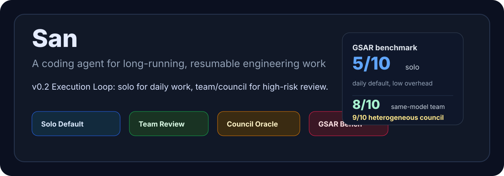
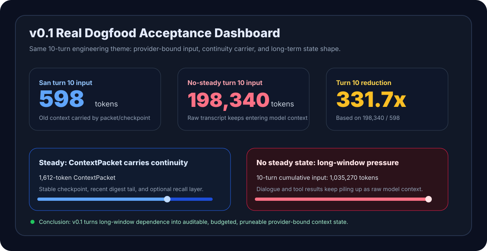
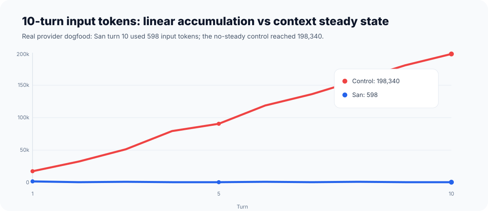
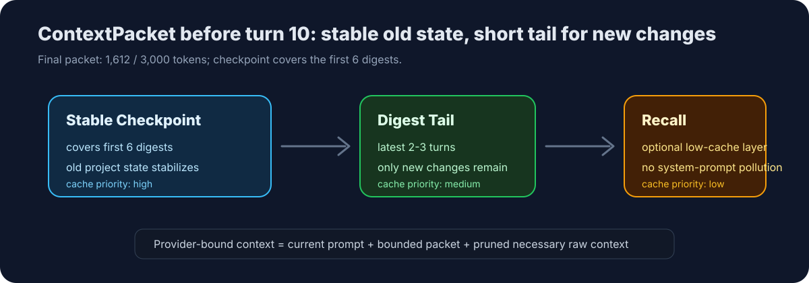

# San

[中文](README.md) | **English**

<p align="center">
  
</p>

<p align="center">
  
  
  = 1.3.14" />
  
</p>

San is a coding agent for long-running, resumable engineering work. It originated from a mature tool-driven coding-agent foundation and now moves forward as an independent project focused on a narrower systems problem: after many turns of discussion, code changes, verification, and resume, the agent should still preserve stable, auditable, and compact context state, then execute high-risk work through explicit roles, review, and closure.

San's current public release is **San v0.2 Execution Loop**. v0.1 Context Steady solved long-running context stability; v0.2 builds on that foundation and turns planning, execution, verification, and failure handling into an auditable engineering loop.

**One-line version**: San still defaults to low-overhead `solo` mode for daily coding work. When a task becomes architectural, release-critical, regression-prone, or easy to misjudge, switch to `team` or `council` so Commander, Worker, Supervisor, and Oracle roles can split the work and write evidence into the ledger.

## What You Can See Today

| Result | Current evidence | Why it matters |
| --- | ---: | --- |
| v0.2 execution loop can be dogfooded | `/san-loop run`, role ledger, San Checks, `solo/team/council` | San is not just a chat agent; it is an engineering execution system with roles, review, and records |
| GSAR benchmark produced a controlled comparison | `solo` 5/10, same-model multi-role 8/10, heterogeneous multi-role 9/10 | multi-role improves complex-task pass rate, but should not be forced onto every daily task |
| v0.1 context steady state is validated | turn 10 at `598 tokens`, control at `198,340 tokens` | provider-bound context no longer grows linearly with raw transcript |
| Local config moved to the San namespace | default `~/.san`, project `.san`, preferred `SAN_*` env vars | local installation and use no longer depend on `.omp` paths |

**Fast Acceptance Entry Points**:

- **v0.2 recommended config**: `san --config packages/coding-agent/examples/config/san-execution-loop-recommended.yml`
- **v0.2 benchmark control report**: `docs/research/san-gsar-controls-run-20260706-111813.html`
- **v0.2 heterogeneous multi-role report**: `docs/research/san-gsar-qwen-opus-run-20260706-100034.html`
- **v0.2 benchmark task set**: `packages/coding-agent/examples/san-gsar-benchmark-tasks.json`
- **v0.1 quality report**: `docs/research/context-steady-v0.1-quality-acceptance-report.html`
- **Local verification**: `bun check` + `HOME=/private/tmp/san-test-home bun test packages/coding-agent/test/context-steady packages/coding-agent/test/san-loop`

## Why San

Most coding agents work well on short tasks, then degrade as the transcript grows. Three failure modes show up quickly:

- **Context growth**: prior dialogue, tool results, and intermediate reasoning keep accumulating in provider-bound context.
- **Continuity loss**: after compression or resume, the agent can lose important decisions, touched files, risks, and acceptance criteria.
- **Weak auditability**: important state remains buried in raw transcript instead of becoming explicit runtime state.

San treats continuity as a runtime-system problem, not as an ever-longer prompt.

## Context Steady v0.1

San v0.1 introduces a context steady pipeline: each completed agent turn can be distilled into structured state, and later turns can read that state through a bounded ContextPacket.

The v0.1 surface is ready to describe publicly:

- **TurnDigest ledger**: each settled turn can persist a `san.turn_digest` entry with user intent, actions taken, decisions, files touched, risks, next steps, memory candidates, and tool evidence.
- **Stable checkpoints**: older digest history rolls into `san.context_checkpoint` entries so long-lived project state remains available without replaying the full raw transcript.
- **Bounded ContextPackets**: before the next real user prompt, San can inject a `san.context_packet` assembled from stable checkpoints, recent digest tail, and optional recall results under an explicit token budget.
- **Provider payload pruning**: raw transcript spans already covered by ContextPacket evidence can be removed before provider send, reducing linear active-context growth.
- **Optional LLM digesting**: deterministic fallback digests remain available; `san.contextSteady.digest.llm.*` can enable a side LLM to improve semantic digest quality without becoming a hard dependency.
- **Dogfood acceptance baseline**: deterministic verifiers and real 10-turn dogfood artifacts are included to validate whether the system is actually steady, not merely injecting another summary.

### v0.1 Acceptance Evidence

San v0.1 is not validated by checking whether a summary was injected. The acceptance question is whether provider-bound context stops carrying equivalent raw transcript while later turns still preserve task continuity.

The current public report is based on two real 10-turn conversations:

<p align="center">
  
</p>

<p align="center">
  
</p>

| Metric | San Context Steady v0.1 | No San steady-state control |
| --- | ---: | ---: |
| Turn 10 input | 598 tokens | 198,340 tokens |
| 10-turn cumulative input | small window + ContextPacket continuity | 1,035,270 tokens |
| Turn 10 continuity carrier | 1,612-token ContextPacket | large raw-history surface |
| Long-term state | 1 checkpoint covering the first 6 digests | raw transcript keeps accumulating |
| Acceptance result | provider-bound steady-state mechanism is present | long-window pressure, not engineering steady state |

In concrete terms: San's 10th turn needed only 598 input tokens plus a 1,612-token ContextPacket to carry continuity. Under the same 10-turn theme, the control run reached 198,340 input tokens on turn 10. This is the core v0.1 claim: long-context behavior is converted into auditable, budgeted, pruneable context state.

This is not a prompt-specific rule. The acceptance target is a general runtime property: old state becomes structured, model-bound history becomes pruneable, and later turns can still recover files, decisions, risks, and acceptance criteria. In other words, San v0.1 stabilizes how an agent receives context during long engineering tasks.

<p align="center">
  
</p>

The ContextPacket is not just a shorter summary. It separates old state into a stable layer, keeps new changes in a short tail, and places optional recall in a low-cache layer. Later turns keep access to prior conclusions without repeatedly carrying the same raw transcript in provider-bound payloads.

Evidence sources:

- Quality acceptance report: `docs/research/context-steady-v0.1-quality-acceptance-report.html`
- Real 10-turn dogfood summaries: `docs/research/context-steady-dogfood-runs/`
- Key test: `packages/coding-agent/test/context-steady/agent-session-m2.test.ts`
- Steady-state pruning implementation: `packages/coding-agent/src/context-steady/prune.ts`
- ContextPacket builder: `packages/coding-agent/src/context-steady/packet.ts`

The boundary is explicit: v0.1 stabilizes **provider-bound context**. It does not physically delete the session journal. Raw transcript remains append-only for audit, resume, and debug; model-bound context is controlled by packets, checkpoints, the quality window, and pruning.

Recommended v0.1 dogfood config:

```sh
san --config packages/coding-agent/examples/config/san-context-steady-recommended.yml
```

The external v0.1 claim is threefold:

- **Stable input size**: turn-10 provider-bound input no longer grows linearly with raw transcript.
- **Stable task continuity**: ContextPacket preserves goals, key changes, evidence, risks, and next steps.
- **Stable audit path**: raw session journal remains append-only while digest/checkpoint/packet control model-side context budget.

## San v0.2 Execution Loop

San v0.2 is the current public release target. It does not turn every task into a multi-agent process. It adds explicit execution modes to a coding agent: keep daily work in low-overhead `solo`, then switch to `team` or `council` for complex work where independent execution, review, and an append-only ledger are worth the overhead.

### Execution Modes

| Mode | Use case | Role shape | Product stance |
| --- | --- | --- | --- |
| `solo` | daily fixes, small changes, clear requirements | single agent, single role | default path, lowest latency and cost |
| `team` | medium/high-risk changes, test-suite repair, tasks needing independent review | Commander + Worker + Supervisor | recommended smart mode, clear quality upside with extra overhead |
| `council` | architecture calls, release acceptance, cross-module tradeoffs, high-ambiguity failures | Commander + Worker + Supervisor + Oracle | recommended deep mode for a small number of high-risk decisions |

The old `rush/smart/deep` names have been consolidated into `solo/team/council`. The product claim is now sharper: San v0.2 is not "more agents are always better"; it is an auditable execution loop when task risk justifies the extra work.

### GSAR Benchmark Result

The GSAR benchmark compares three execution shapes on the same 10-task suite, covering goal retention, distraction resistance, hidden blockers, regression detection, error-continuation interception, and ROI constraints.

| Run shape | Pass rate | Total tokens | Wall time | Conclusion |
| --- | ---: | ---: | ---: | --- |
| Single Agent Baseline | 5/10 | 4.84M | 32.25 min | right daily default; missed hidden blockers, regressions, and error-continuation cases |
| Multi-role Same Model | 8/10 | 5.90M | 65.47 min | passed 3 more tasks than single agent, but took about 2.03x wall time, so it should not be always-on |
| Multi-role Heterogeneous | 9/10 | 4.48M | 57.96 min | strongest current quality sample, suitable for `team/council` high-risk modes |

The product conclusion is direct:

- **Daily use should default to `solo`**: low-risk tasks do not justify the extra time and token spend of multi-role execution.
- **`team` is the quality switch**: same-model multi-role improved from 5/10 to 8/10, showing that independent Worker/Supervisor review catches real misses.
- **`council` is the deep-judgment switch**: heterogeneous multi-role reached 9/10 in this single run and is better suited to release gates, architecture tradeoffs, and complex failure analysis.
- **The evidence does not justify always-on multi-role yet**: this is still single-run evidence; the next benchmark step is at least 3 runs for mean and variance.
- **Cost is reported as tokens and time for now**: provider pricing was not fully normalized, so the public report uses tokens, non-cache tokens, pass rate, and wall time as auditable metrics.

Report entry points:

- Control benchmark: `docs/research/san-gsar-controls-run-20260706-111813.html`
- Heterogeneous multi-role benchmark: `docs/research/san-gsar-qwen-opus-run-20260706-100034.html`
- Task set: `packages/coding-agent/examples/san-gsar-benchmark-tasks.json`

### What v0.2 Includes

- Commander / Worker / Supervisor / Oracle role infrastructure
- append-only loop ledger entries
- San Checks discovery and rendering
- `/san-loop run`, `/san-loop stop`, and `/san-loop status`
- solo / team / council modes
- native `~/.san` and project `.san` config directories, with `SAN_*` env vars preferred and legacy vars still accepted
- deterministic dogfood verifier

Recommended v0.2 dogfood config:

```sh
san --config packages/coding-agent/examples/config/san-execution-loop-recommended.yml
```

Typical runs:

```sh
/san-loop run --mode solo "<objective>"
/san-loop run --mode team "<objective>"
/san-loop run --mode council "<objective>"
```

## Install from Source

This repository is currently source-first.

```sh
git clone git@github.com:slicenferqin/san.git
cd san
bun install
bun run setup
```

Run the CLI from source:

```sh
bun run dev
```

After `bun run setup`, the local `san` command is linked into your Bun bin directory:

```sh
san
```

Requirements:

- Bun `>= 1.3.14`
- macOS, Linux, or Windows with a working Bun environment

## Verification

Common verification commands:

```sh
bun check
HOME=/private/tmp/san-test-home bun test packages/coding-agent/test/context-steady packages/coding-agent/test/san-loop
git diff --check
```

The context steady dogfood verifier currently covers digest persistence, ContextPacket injection, checkpoint layering, token-budget bounds, recall-layer behavior, provider-payload pruning, and resume/replay safety.

## Repository Layout

| Path | Purpose |
| --- | --- |
| `packages/coding-agent/` | Main `san` CLI implementation |
| `packages/coding-agent/src/context-steady/` | Context steady TurnDigest, checkpoint, packet, recall, relevance, and pruning logic |
| `packages/coding-agent/src/san-loop/` | San v0.2 execution-loop ledger, checks, runner, and role context |
| `packages/coding-agent/examples/config/` | Recommended dogfood config overlays |
| `packages/coding-agent/test/context-steady/` | Context steady contract tests |
| `packages/coding-agent/test/san-loop/` | Execution-loop contract tests |
| `docs/research/` | Design notes, acceptance reports, and dogfood artifacts |

## Public Materials

- `docs/research/context-steady-v0.1-quality-acceptance-report.html`
- `docs/research/context-steady-v0.1-fix-plan.html`
- `docs/research/context-steady-dogfood-runs/`
- `docs/research/san-v0.2-technical-design.html`
- `docs/research/san-v0.2-validation-readiness.html`
- `docs/research/san-gsar-controls-run-20260706-111813.html`
- `docs/research/san-gsar-qwen-opus-run-20260706-100034.html`
- `packages/coding-agent/examples/san-gsar-benchmark-tasks.json`

## Origin And Credits

San is now an independent repository: [`slicenferqin/san`](https://github.com/slicenferqin/san). The early codebase originated from [`oh-my-pi`](https://github.com/can1357/oh-my-pi), which itself builds on Mario Zechner's Pi work. San inherits the original tool-rich coding-agent surface: file tools, shell execution, LSP, debugger integration, subagents, browser, web search, collaboration, and memory backends.

This README focuses on San-specific work and current acceptance-ready capabilities. The repository retains `@oh-my-pi/*` only in explicit compatibility layers such as legacy plugin resolution; public packages, repository links, config directories, commands, and release narrative use San.

## License

San's original code is licensed under the [MIT License](LICENSE). The native shell minimizer
contains adapted third-party components under Apache-2.0 and MIT; see
[`crates/pi-shell/NOTICE`](crates/pi-shell/NOTICE).
