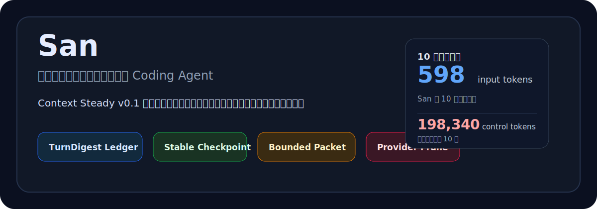
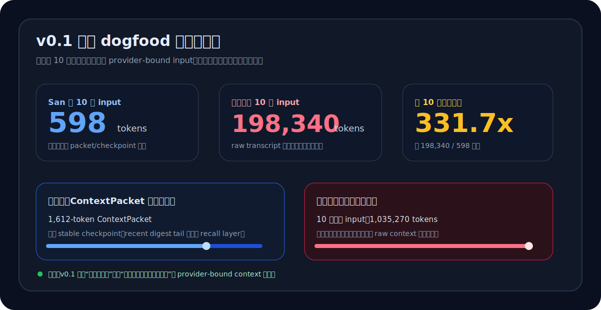
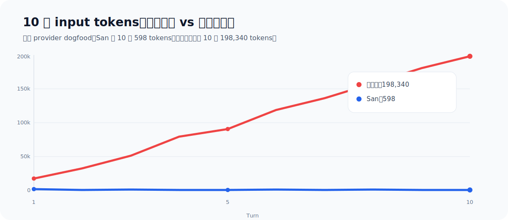
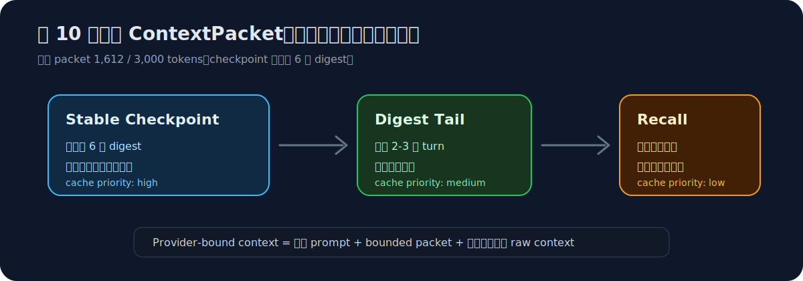

# San

**中文** | [English](README.en.md)

<p align="center">
  
</p>

<p align="center">
  
  
  = 1.3.14" />
  
</p>

San 是一个面向长期、可恢复工程任务的 coding agent。它从 `omp` fork 而来，保留成熟的工具化编码能力，并把重点推进到一个更具体的问题：当对话、代码修改、验证和恢复跨越很多轮之后，agent 仍然应该保有稳定、可审计、可压缩的上下文状态。

San 的第一个对外里程碑是 **San Context Steady v0.1**。

**一句话版本**：San 不把“能塞进更长上下文”当成答案，而是把长期对话沉淀成可审计 ledger、stable checkpoint 和有预算的 ContextPacket，让模型侧上下文进入稳态。

## 现在能看到什么

| 结果 | v0.1 证据 | 意义 |
| --- | ---: | --- |
| 输入规模稳住 | 第 10 轮 `598 tokens` | provider-bound context 不再随 raw transcript 线性膨胀 |
| 长窗口压力下降 | 对照组第 10 轮 `198,340 tokens` | 同类任务下，San 把旧上下文转为 packet/checkpoint |
| 连续性可恢复 | `1,612-token ContextPacket` | 后续 turn 仍保留目标、文件、决策、风险和验收口径 |
| 审计链路保留 | `1 checkpoint` 覆盖前 6 个 digest | raw session journal 继续 append-only，用于 resume/debug/audit |

这组数字不是为了证明某个固定 prompt 被“命中”，而是证明 San 的运行时开始具备通用稳态性质：旧状态结构化、模型侧历史可裁剪、下一轮仍能恢复任务上下文。

**快速验收入口**：

- **推荐配置**：`san --config packages/coding-agent/examples/config/san-context-steady-recommended.yml`
- **质量报告**：`docs/research/context-steady-v0.1-quality-acceptance-report.html`
- **核心测试**：`packages/coding-agent/test/context-steady/agent-session-m2.test.ts`
- **本地校验**：`bun check` + `HOME=/private/tmp/san-test-home bun test packages/coding-agent/test/context-steady packages/coding-agent/test/san-loop`

## 为什么需要 San

多数 coding agent 在短任务里表现不错，但随着 transcript 增长，会逐渐暴露三个问题：

- **上下文膨胀**：历史对话、工具结果和中间判断不断堆叠，provider-bound context 越来越大。
- **连续性退化**：压缩或恢复后，agent 可能丢失真正重要的决策、文件触达、风险和验收口径。
- **状态不可审计**：历史被动堆在 raw transcript 里，难以判断哪些信息仍然应该影响下一轮。

San 的思路是把“上下文连续性”当成运行时系统问题处理，而不是继续依赖一个越来越长的 prompt。

## Context Steady v0.1

San v0.1 引入一条 context steady pipeline：每个已完成的 agent turn 会沉淀成结构化状态，后续 turn 再通过有预算约束的 ContextPacket 读取这些状态。

当前 v0.1 已具备可对外说明的能力：

- **TurnDigest ledger**：每个 settled turn 可持久化为 `san.turn_digest`，记录用户意图、执行动作、关键决策、触达文件、风险、下一步、memory candidates 和 tool evidence。
- **Stable checkpoint**：较早的 digest 历史会滚动沉淀为 `san.context_checkpoint`，保留长期项目状态，避免重复发送完整 raw transcript。
- **Bounded ContextPacket**：下一轮真实用户 prompt 前可注入 `san.context_packet`，按显式 token budget 组合 stable checkpoint、recent digest tail 和可选 recall 结果。
- **Provider payload pruning**：已被 ContextPacket 覆盖的历史 raw transcript span 可在发送 provider 前被剪掉，降低 active context 线性膨胀。
- **可选 LLM digest**：默认 deterministic fallback 仍然可用；开启 `san.contextSteady.digest.llm.*` 后，可用侧路 LLM 提升摘要质量，不把主流程变成硬依赖。
- **Dogfood 验收基线**：仓库包含 deterministic verifier 和真实 10 轮 dogfood 产物，用于判断系统是否真的稳住，而不只是额外注入了一段摘要。

### v0.1 验收证据

San v0.1 的验收不是只看“有没有注入摘要”，而是看 provider-bound context 是否真的停止携带等量旧 transcript，同时后续 turn 是否仍能维持任务连续性。

当前公开报告基于两组真实 10 轮对话：

<p align="center">
  
</p>

<p align="center">
  
</p>

| 指标 | San Context Steady v0.1 | 无 San 稳态对照 |
| --- | ---: | ---: |
| 第 10 轮 input | 598 tokens | 198,340 tokens |
| 10 轮累计 input | 小窗口 + ContextPacket 承接连续性 | 1,035,270 tokens |
| 第 10 轮连续性载体 | 1,612-token ContextPacket | 继续携带大段历史上下文 |
| 长期状态 | 1 个 checkpoint 覆盖前 6 个 digest | raw transcript 继续堆叠 |
| 验收结论 | provider-bound 层具备稳态机制 | 依赖长窗口承压，不是工程稳态 |

更具体地说：San 的第 10 轮只需要 598 input tokens 加一个 1,612-token ContextPacket 承接上下文；对照组在同样 10 轮主题下，第 10 轮 input 达到 198,340 tokens。这个对比说明 v0.1 已经把“长上下文能力”转成了“可审计、可预算、可裁剪的上下文稳态机制”。

这不是为某个固定 prompt 写规则。验收关注的是通用运行时性质：旧状态是否结构化、进入模型的历史是否可裁剪、下一轮是否仍能拿到文件、决策、风险和验收口径。换句话说，San v0.1 稳住的是 agent 在长任务里的上下文供给方式。

<p align="center">
  
</p>

ContextPacket 的核心不是“摘要文本更短”，而是把旧状态拆到稳定层，把新变化留在短尾层，再把可选 recall 放进低缓存层。这样后续 turn 能继续使用历史结论，但 provider-bound payload 不需要重复携带同一段 raw transcript。

证据来源：

- 质量验收报告：`docs/research/context-steady-v0.1-quality-acceptance-report.html`
- 真实 10 轮 dogfood 摘要：`docs/research/context-steady-dogfood-runs/`
- 关键测试：`packages/coding-agent/test/context-steady/agent-session-m2.test.ts`
- 稳态裁剪实现：`packages/coding-agent/src/context-steady/prune.ts`
- ContextPacket 构建：`packages/coding-agent/src/context-steady/packet.ts`

当前边界也很明确：v0.1 稳住的是 **provider-bound context**，不是物理删除 session journal。raw transcript 仍然 append-only 保留，用于审计、resume 和 debug；进入模型的上下文则由 packet、checkpoint、quality window 和 prune 共同控制。

推荐 v0.1 dogfood 配置：

```sh
san --config packages/coding-agent/examples/config/san-context-steady-recommended.yml
```

v0.1 的对外 claim 可以概括为三点：

- **稳住输入规模**：第 10 轮 provider-bound input 没有随 raw transcript 线性膨胀。
- **稳住任务连续性**：ContextPacket 保留用户目标、关键改动、证据来源、风险和下一步。
- **稳住审计链路**：raw session journal 仍保留，digest/checkpoint/packet 负责模型侧上下文预算。

## San v0.2 执行循环

`main` 分支已合入 San v0.2 execution loop 基础能力。v0.2 不是替代 v0.1，而是在 context steady 之上继续推进 agent 的工程执行闭环。

当前 v0.2 包含：

- Commander / Worker / Supervisor / Oracle 角色基础设施
- append-only loop ledger entries
- San Checks 发现与渲染
- `/san-loop run`、`/san-loop stop`、`/san-loop status`
- rush / smart / deep 模式
- deterministic dogfood verifier

推荐 v0.2 dogfood 配置：

```sh
san --config packages/coding-agent/examples/config/san-execution-loop-recommended.yml
```

## 从源码安装

当前仓库仍以源码使用为主。

```sh
git clone git@github.com:slicenferqin/san.git
cd san
bun install
bun run setup
```

源码方式启动：

```sh
bun run dev
```

执行 `bun run setup` 后，本地 `san` 命令会链接到 Bun bin 目录：

```sh
san
```

环境要求：

- Bun `>= 1.3.14`
- macOS、Linux，或可正常运行 Bun 的 Windows 环境

## 验证

常用验证命令：

```sh
bun check
HOME=/private/tmp/san-test-home bun test packages/coding-agent/test/context-steady packages/coding-agent/test/san-loop
git diff --check
```

Context steady dogfood verifier 当前覆盖 digest 持久化、ContextPacket 注入、checkpoint 分层、token budget 约束、recall layer、provider-payload pruning、resume/replay 安全性等核心契约。

## 仓库结构

| 路径 | 说明 |
| --- | --- |
| `packages/coding-agent/` | `san` CLI 主实现 |
| `packages/coding-agent/src/context-steady/` | Context steady 的 TurnDigest、checkpoint、packet、recall、relevance 和 pruning 逻辑 |
| `packages/coding-agent/src/san-loop/` | San v0.2 execution loop 的 ledger、checks、runner 和 role context |
| `packages/coding-agent/examples/config/` | 推荐 dogfood 配置 |
| `packages/coding-agent/test/context-steady/` | Context steady 合同测试 |
| `packages/coding-agent/test/san-loop/` | Execution loop 合同测试 |
| `docs/research/` | 设计文档、验收报告和 dogfood 产物 |

## 对外材料

- `docs/research/context-steady-v0.1-quality-acceptance-report.html`
- `docs/research/context-steady-v0.1-fix-plan.html`
- `docs/research/context-steady-dogfood-runs/`
- `docs/research/san-v0.2-technical-design.html`
- `docs/research/san-v0.2-validation-readiness.html`

## 上游关系

San fork 自 [`oh-my-pi`](https://github.com/can1357/oh-my-pi)，而 `oh-my-pi` 又源自 Mario Zechner 的 Pi 工作。San 继承了原有的工具化编码能力，包括文件工具、shell、LSP、debugger、subagents、browser、web search、collaboration 和 memory backends。

这个 README 聚焦 San 自身新增的方向和当前可验收能力。仓库内仍保留部分 upstream 文档与包名引用，后续会随 fork 产品化逐步清理。

## License

MIT. See [LICENSE](LICENSE).
