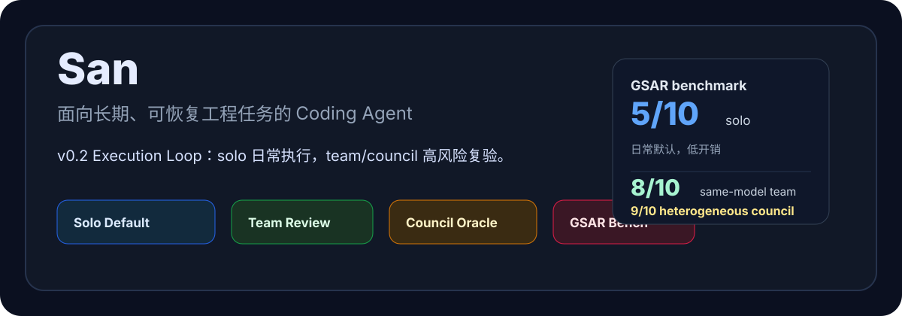
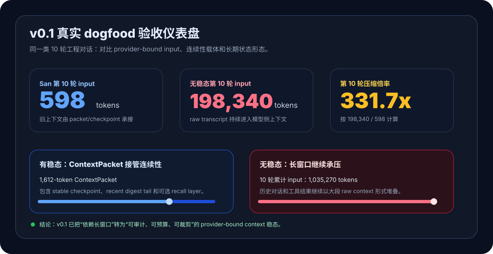
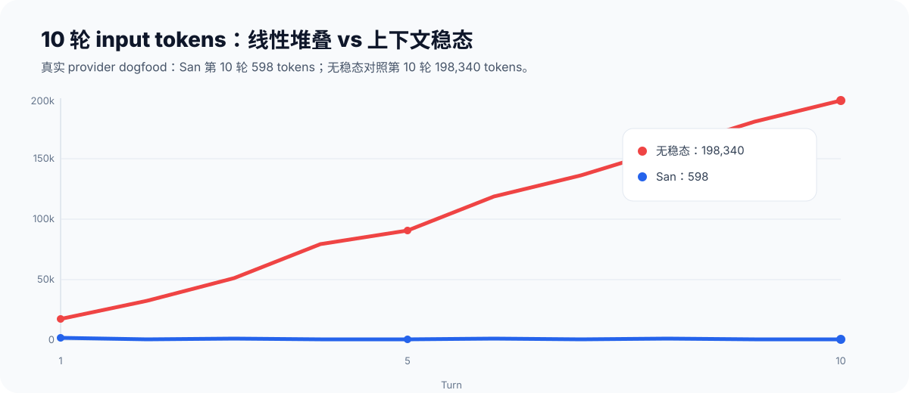
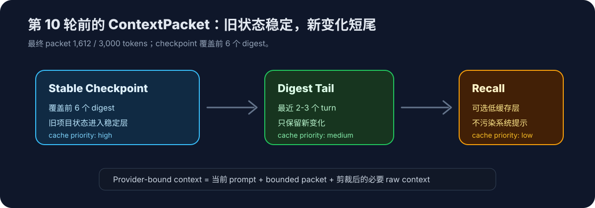

# San

**中文** | [English](README.en.md)

<p align="center">
  
</p>

<p align="center">
  
  
  = 1.3.14" />
  
</p>

San 是一个面向长期、可恢复工程任务的 coding agent。它源自成熟的工具化编码基础，现在作为独立项目推进一个更具体的问题：当对话、代码修改、验证和恢复跨越很多轮之后，agent 仍然应该保有稳定、可审计、可压缩的上下文状态，并且能在高风险任务里按明确角色分工执行、复验和收口。

San 当前对外版本是 **San v0.2 Execution Loop**。v0.1 Context Steady 解决长任务上下文稳态；v0.2 在这个底座上，把“计划、执行、复验、失败收口”推进成可审计的工程执行循环。

**一句话版本**：San 默认仍可以像普通 coding agent 一样用 `solo` 低开销完成日常任务；遇到架构变更、发布验收、复杂修复和容易误判的场景时，可以切到 `team` 或 `council`，让 Commander、Worker、Supervisor、Oracle 分工，并把证据写进 ledger。

## 现在能看到什么

| 结果 | 当前证据 | 意义 |
| --- | ---: | --- |
| v0.2 执行循环已可 dogfood | `/san-loop run`、role ledger、San Checks、`solo/team/council` | San 不只是聊天代理，而是有角色、有验收、有记录的工程执行系统 |
| GSAR benchmark 给出对照结论 | `solo` 5/10，同模型多角色 8/10，异构多角色 9/10 | 多角色能提升复杂任务通过率，但不应默认套到所有日常任务 |
| v0.1 上下文稳态已验证 | 第 10 轮 `598 tokens`，对照组 `198,340 tokens` | provider-bound context 不再随 raw transcript 线性膨胀 |
| 本地配置已切到 San 命名空间 | 默认 `~/.san`、项目 `.san`、优先 `SAN_*` | 本地安装和使用不再依赖 `.omp` 目录 |

**快速验收入口**：

- **v0.2 推荐配置**：`san --config packages/coding-agent/examples/config/san-execution-loop-recommended.yml`
- **v0.2 benchmark 对照报告**：`docs/research/san-gsar-controls-run-20260706-111813.html`
- **v0.2 异构多角色报告**：`docs/research/san-gsar-qwen-opus-run-20260706-100034.html`
- **v0.2 benchmark 任务集**：`packages/coding-agent/examples/san-gsar-benchmark-tasks.json`
- **v0.1 质量报告**：`docs/research/context-steady-v0.1-quality-acceptance-report.html`
- **本地校验**：`bun check` + `HOME=/private/tmp/san-test-home bun test packages/coding-agent/test/context-steady packages/coding-agent/test/san-loop`

## 为什么需要 San

多数 coding agent 在短任务里表现不错，但随着 transcript 增长，会逐渐暴露三个问题：

- **上下文膨胀**：历史对话、工具结果和中间判断不断堆叠，provider-bound context 越来越大。
- **连续性退化**：压缩或恢复后，agent 可能丢失真正重要的决策、文件触达、风险和验收口径。
- **状态不可审计**：历史被动堆在 raw transcript 里，难以判断哪些信息仍然应该影响下一轮。

San 的思路是把“上下文连续性”当成运行时系统问题处理，而不是继续依赖一个越来越长的 prompt。

## Context Steady v0.1

San v0.1 引入一条 context steady pipeline：每个已完成的 agent turn 会沉淀成结构化状态，后续 turn 再通过有预算约束的 ContextPacket 读取这些状态。

当前 v0.1 已具备可对外说明的能力：

- **TurnDigest ledger**：每个 settled turn 可持久化为 `san.turn_digest`，记录用户意图、执行动作、关键决策、触达文件、风险、下一步、memory candidates 和 tool evidence。
- **Stable checkpoint**：较早的 digest 历史会滚动沉淀为 `san.context_checkpoint`，保留长期项目状态，避免重复发送完整 raw transcript。
- **Bounded ContextPacket**：下一轮真实用户 prompt 前可注入 `san.context_packet`，按显式 token budget 组合 stable checkpoint、recent digest tail 和可选 recall 结果。
- **Provider payload pruning**：已被 ContextPacket 覆盖的历史 raw transcript span 可在发送 provider 前被剪掉，降低 active context 线性膨胀。
- **可选 LLM digest**：默认 deterministic fallback 仍然可用；开启 `san.contextSteady.digest.llm.*` 后，可用侧路 LLM 提升摘要质量，不把主流程变成硬依赖。
- **Dogfood 验收基线**：仓库包含 deterministic verifier 和真实 10 轮 dogfood 产物，用于判断系统是否真的稳住，而不只是额外注入了一段摘要。

### v0.1 验收证据

San v0.1 的验收不是只看“有没有注入摘要”，而是看 provider-bound context 是否真的停止携带等量旧 transcript，同时后续 turn 是否仍能维持任务连续性。

当前公开报告基于两组真实 10 轮对话：

<p align="center">
  
</p>

<p align="center">
  
</p>

| 指标 | San Context Steady v0.1 | 无 San 稳态对照 |
| --- | ---: | ---: |
| 第 10 轮 input | 598 tokens | 198,340 tokens |
| 10 轮累计 input | 小窗口 + ContextPacket 承接连续性 | 1,035,270 tokens |
| 第 10 轮连续性载体 | 1,612-token ContextPacket | 继续携带大段历史上下文 |
| 长期状态 | 1 个 checkpoint 覆盖前 6 个 digest | raw transcript 继续堆叠 |
| 验收结论 | provider-bound 层具备稳态机制 | 依赖长窗口承压，不是工程稳态 |

更具体地说：San 的第 10 轮只需要 598 input tokens 加一个 1,612-token ContextPacket 承接上下文；对照组在同样 10 轮主题下，第 10 轮 input 达到 198,340 tokens。这个对比说明 v0.1 已经把“长上下文能力”转成了“可审计、可预算、可裁剪的上下文稳态机制”。

这不是为某个固定 prompt 写规则。验收关注的是通用运行时性质：旧状态是否结构化、进入模型的历史是否可裁剪、下一轮是否仍能拿到文件、决策、风险和验收口径。换句话说，San v0.1 稳住的是 agent 在长任务里的上下文供给方式。

<p align="center">
  
</p>

ContextPacket 的核心不是“摘要文本更短”，而是把旧状态拆到稳定层，把新变化留在短尾层，再把可选 recall 放进低缓存层。这样后续 turn 能继续使用历史结论，但 provider-bound payload 不需要重复携带同一段 raw transcript。

证据来源：

- 质量验收报告：`docs/research/context-steady-v0.1-quality-acceptance-report.html`
- 真实 10 轮 dogfood 摘要：`docs/research/context-steady-dogfood-runs/`
- 关键测试：`packages/coding-agent/test/context-steady/agent-session-m2.test.ts`
- 稳态裁剪实现：`packages/coding-agent/src/context-steady/prune.ts`
- ContextPacket 构建：`packages/coding-agent/src/context-steady/packet.ts`

当前边界也很明确：v0.1 稳住的是 **provider-bound context**，不是物理删除 session journal。raw transcript 仍然 append-only 保留，用于审计、resume 和 debug；进入模型的上下文则由 packet、checkpoint、quality window 和 prune 共同控制。

推荐 v0.1 dogfood 配置：

```sh
san --config packages/coding-agent/examples/config/san-context-steady-recommended.yml
```

v0.1 的对外 claim 可以概括为三点：

- **稳住输入规模**：第 10 轮 provider-bound input 没有随 raw transcript 线性膨胀。
- **稳住任务连续性**：ContextPacket 保留用户目标、关键改动、证据来源、风险和下一步。
- **稳住审计链路**：raw session journal 仍保留，digest/checkpoint/packet 负责模型侧上下文预算。

## San v0.2 执行循环

San v0.2 是当前准备对外发布的主版本：它不是把所有任务都升级成多 agent，而是给 coding agent 加上一套可选择的执行档位。日常任务保持 `solo` 低开销；复杂任务打开 `team` 或 `council`，用角色分工、独立复验和 append-only ledger 降低误判风险。

### 执行档位

| 模式 | 使用场景 | 角色形态 | 产品判断 |
| --- | --- | --- | --- |
| `solo` | 日常修复、小改动、明确需求 | 单 agent 单角色 | 默认路径，速度和成本最低 |
| `team` | 中高风险改动、测试集修复、需要独立 review 的任务 | Commander + Worker + Supervisor | 推荐作为 smart 档，质量收益明确但有额外开销 |
| `council` | 架构判断、发布验收、跨模块取舍、容易误判的任务 | Commander + Worker + Supervisor + Oracle | 推荐作为 deep 档，用于少数高风险决策 |

旧的 `rush/smart/deep` 命名已经收敛为 `solo/team/council`。产品口径也随之更清楚：San v0.2 的价值不是“更多 agent 永远更好”，而是在风险足够高时提供可审计的执行循环。

### GSAR benchmark 结论

GSAR benchmark 用同一组 10 个任务对比三种运行形态，覆盖目标保持、干扰抵抗、隐藏 blocker、回归检测、错误继续执行拦截和 ROI 约束等场景。

| 运行形态 | 通过率 | 总 token | 墙钟时间 | 结论 |
| --- | ---: | ---: | ---: | --- |
| Single Agent Baseline | 5/10 | 4.84M | 32.25 min | 适合日常默认；在隐藏 blocker、回归和错误继续执行场景漏检明显 |
| Multi-role Same Model | 8/10 | 5.90M | 65.47 min | 比单 agent 多通过 3 个任务，但耗时约 2.03x，不适合作为默认常开 |
| Multi-role Heterogeneous | 9/10 | 4.48M | 57.96 min | 当前最强质量样本，适合 `team/council` 高风险档 |

这组结果给出的产品判断很直接：

- **日常使用默认 `solo`**：低风险任务不值得为多角色支付额外时间和 token。
- **`team` 是质量开关**：同模型多角色从 5/10 提升到 8/10，说明独立 Worker/Supervisor 复验能真实捕捉单 agent 漏掉的问题。
- **`council` 是深度判断开关**：异构多角色单轮达到 9/10，更适合发布前验收、架构取舍和复杂 failure analysis。
- **当前证据不支持默认全量开启多角色**：benchmark 仍是单轮样本，下一步需要 3 轮以上均值和方差；README 对外只声明“可选高风险档位有效”，不声明“所有任务都应该多角色”。
- **成本口径先看 token 和时间**：当前 benchmark provider 成本没有完整计价，因此报告使用 token、non-cache token、通过率和墙钟时间作为可复查指标。

报告入口：

- 对照 benchmark：`docs/research/san-gsar-controls-run-20260706-111813.html`
- 异构多角色 benchmark：`docs/research/san-gsar-qwen-opus-run-20260706-100034.html`
- 任务集：`packages/coding-agent/examples/san-gsar-benchmark-tasks.json`

### v0.2 已包含

- Commander / Worker / Supervisor / Oracle 角色基础设施
- append-only loop ledger entries
- San Checks 发现与渲染
- `/san-loop run`、`/san-loop stop`、`/san-loop status`
- solo / team / council 模式
- 默认使用 `~/.san` 和项目 `.san` 配置目录，优先读取 `SAN_*` 环境变量并兼容旧变量
- deterministic dogfood verifier

推荐 v0.2 dogfood 配置：

```sh
san --config packages/coding-agent/examples/config/san-execution-loop-recommended.yml
```

典型运行方式：

```sh
/san-loop run --mode solo "<objective>"
/san-loop run --mode team "<objective>"
/san-loop run --mode council "<objective>"
```

## 从源码安装

当前仓库仍以源码使用为主。

```sh
git clone git@github.com:slicenferqin/san.git
cd san
bun install
bun run setup
```

源码方式启动：

```sh
bun run dev
```

## Every tool, _benchmaxxed_.

Edits that land on the first attempt. Reads that summarize files instead of dumping their content. Searches that return instantly. Pick any model — omp will get it right.

| model            | metric       | what                                                                  |
| ---------------- | ------------ | --------------------------------------------------------------------- |
| Grok Code Fast 1 | 6.7% → 68.3% | Tenfold lift the moment the edit format stops eating the model alive. |
| Gemini 3 Flash   | +5 pp        | Over str_replace — beats Google's own best attempt at the format.     |
| Grok 4 Fast      | −61% tokens  | Output collapses once the retry loop on bad diffs disappears.         |
| MiniMax          | 2.1×         | Pass rate more than doubles. Same weights, same prompt.               |

- `read` : summarized snippets · ideal defaults · selector hit rate
- `search` : fastest in the west
- `lsp` : everything your IDE knows, the agent knows
- `prompts` : adjusted relentlessly for each model

[Read the full post ↗](https://blog.can.ac/2026/02/12/the-harness-problem/)

## The Pi _you love_, with **batteries included**.

Originally built on [Mario Zechner](https://github.com/mariozechner)'s wonderful [Pi](https://github.com/badlogic/pi-mono), omp adds everything you're missing.

### 01 · Code execution w/ tool-calling

Most harnesses give the agent a Python sandbox and call it done. Ours runs persistent Python and a Bun worker, and either kernel can call back into the agent's own tools — read, search, task — over a loopback bridge. The agent loads a CSV with tool.read from inside Python, charts it from JavaScript, and never leaves the cell.

![omp TUI: a single eval session with `[1/2] pandas describe` (Python) printing a real DataFrame.describe() table, followed by `[2/2] top scorer` (JavaScript) running a reduce. Footer: 'Both kernels ran in one session.'](https://omp.sh/captures/eval.webp)

### 02 · LSP wired into every write

Ask for a rename and you get a rename. The call goes through workspace/willRenameFiles, so re-exports, barrel files, and aliased imports update before the file moves. Everything your IDE knows, the agent knows.


### 03 · Drives a real debugger

A C binary segfaults: the agent attaches lldb, steps to the bad pointer, reads the frame. A Go service hangs: it attaches dlv and walks the goroutines. A Python process is wedged: debugpy, pause, inspect, evaluate. Most agents are still sprinkling print statements.


_[Watch the capture ↗](https://omp.sh/clips/dap.mp4)_

### 04 · Time-traveling stream rules

Your rules sit dormant until the model goes off-script. A regex match aborts the stream mid-token, injects the rule as a system reminder, and retries from the same point. You get course-correction without paying context tax on every turn. Injections survive compaction, so the fix sticks.


_[Watch the capture ↗](https://omp.sh/clips/ttsr.mp4)_

### 05 · First-class subagents

Split a job across workers and get typed results back. task fans out into isolated worktrees, each worker runs its own tool surface, and the final yield is a schema-validated object the parent reads directly. No prose to parse, no merge conflicts between siblings, no orphaned edits.


_[Watch the capture ↗](https://omp.sh/clips/irc.mp4)_

### 06 · A second model, watching every turn.

Pair a reviewer model to the 'advisor' role and it reads every turn the main agent takes, injecting notes inline — a quiet aside, a concern, or a hard blocker. It runs on its own context and its own model, so it catches what the doer rushed past. The main agent sees the note and course-corrects, or tells you why it won't.


_[Watch the capture ↗](https://omp.sh/clips/advisor.mp4)_

### 07 · Hand someone the link, they're in.

/collab puts your live session on a relay and hands back a link — and a QR. A teammate joins from another terminal with omp join, or just opens it in a browser. Share read-write to pair on the same agent, or /collab view for a read-only link anyone can watch but no one can steer. Frames are sealed client-side; the relay never sees your keys.


_[Watch the capture ↗](https://omp.sh/clips/collab.mp4)_

### 08 · Read a pdf on arxiv, why not?

web_search chains eighteen ranked providers and hands whatever URLs it finds straight to read. Arxiv PDFs, GitHub pages, Stack Overflow threads come back as structured markdown with anchors intact — the same tool surface you use on local files. Cite, follow, quote, never lose where you came from.


_[Watch the capture ↗](https://omp.sh/clips/web.mp4)_

### 09 · Unapologetically native. Even on Windows.

Other agents shell out to rg, grep, find, and bash. On many machines those binaries don't exist, and on the ones where they do, every call costs a fork-exec round-trip. omp links the real implementations into the process. ripgrep, glob, find: in-process. brush is the bash, with sessions that survive across calls. The same omp binary runs on macOS, Linux, and Windows — no WSL bridge.

### 10 · Code review with priorities and a verdict

Get a clear verdict on whether the change ships, with every issue ranked P0 through P3 and scored for confidence. /review spawns dedicated reviewer subagents that sweep branches, single commits, or uncommitted work in parallel. You tackle what blocks release first; nothing important hides in a wall of prose.

### 11 · Hashline: edit by content hash

Perfect edits, fewer tokens. The model points at anchors instead of retyping the lines it wants to change, so whitespace battles and string-not-found loops just stop happening. Edit a stale file and the anchors diverge — we reject the patch before it corrupts anything. Grok 4 Fast spends 61% fewer output tokens on the same work.

### 12 · GitHub is just another filesystem

Other harnesses bolt on gh_issue_view, gh_pr_view, gh_search — each with its own parameters the agent has to learn and you have to debug. We skipped that. read already handles paths; PRs are paths. One interface to teach the model, one surface to keep correct.

### 13 · Hindsight: memory the agent curates

The agent remembers your codebase between sessions. It writes facts mid-run with retain, pulls them back with recall, and compresses each session into a mental model that loads on the first turn of the next one. Project-scoped by default, so what it learns about this repo stays with this repo.

### 14 · ACP: editor-drivable agent

Run omp inside Zed and you get the same agent you drive from the terminal — reading the buffer you're actually looking at, writing through the editor's save path, spawning shells in the editor's terminal. Destructive tools pause for a permission prompt you can answer once and forget. No bridge, no plugin, no second brain to keep in sync.

### 15 · Inherits what your other tools already wrote

Every other agent ships an importer and expects you to convert. omp reads the eight formats already on disk in their native shape — Cursor MDC, Cline .clinerules, Codex AGENTS.md, Copilot applyTo, and the rest. No migration script, no YAML-to-TOML port, no "supported subset" footnotes. The config your team wrote last quarter still works tonight.

### 16 · omp commit: atomic splits, validated messages

omp reads the working tree through git_overview, git_file_diff, and git_hunk, then splits unrelated changes into atomic commits ordered by their dependencies. Cycles are rejected before anything is written. Source files score above tests, docs, and configs, so the headline commit is the one that matters. Lock files are excluded from analysis entirely.

### 17 · Read PRs. _Walk skills._ Pull JSON out of subagents.

Twelve internal schemes — `pr://`, `issue://`, `agent://`, `skill://`, `rule://`, and the rest — resolve transparently inside every FS-shaped tool the agent already calls. `read pr://1428` returns the same shape as `read src/foo.ts`. `search` walks a diff like a directory. `agent://<id>/findings.0.path` pulls a field out of a subagent's output by path.

![omp TUI reading pr://can1357/oh-my-pi/1063 and then /diff/1, showing hunk headers, added lines, and a [MODIFIED] (+12 -0) summary.](https://omp.sh/captures/pr.webp)

### 18 · Conflict resolution, made easy.

Each merge conflict becomes one URL. The agent writes `@theirs`, `@ours`, or `@base` to `conflict://N` and the file resolves cleanly. Bulk form: `conflict://*`.


_[Watch the capture ↗](https://omp.sh/clips/conflict.mp4)_

### 19 · Preview, then accept.

`ast_edit` returns a _(proposed)_ card with the replacement count. The change is staged. The agent calls `resolve` with a reason; the TUI turns it into an **Accept** card and the disk move happens — atomic, all or nothing.


_[Watch the capture ↗](https://omp.sh/clips/codemod.mp4)_

### 20 · Drives a _real browser_. _Or your Slack?_

Stealth's on by default, so pages see a normal user instead of a headless bot. The same API drives any Electron app in place — point it at Slack and the agent reads your DMs the way it reads the web.


## Whatever the task needs, _it's already in the box_.

32 tools live in the same namespace as `read` and `bash`. Pin the active set with `--tools read,edit,bash,…`; rarely used discoverable tools stay behind `xd://` devices. `read xd://` lists them, and `write xd://<tool>` runs one when `tools.xdev` is enabled.

**Files & search**

- `read` — files, dirs, archives, SQLite, PDFs, notebooks, URLs, and internal `://` schemes through one path.
- `write` — create or overwrite a file, archive entry, or SQLite row.
- `edit` — hashline patches with content-hash anchors and stale-anchor recovery.
- `ast_edit` — structural rewrites previewed before apply, via ast-grep.
- `ast_grep` — structural code queries over 50+ tree-sitter grammars.
- `search` — regex over files, globs, and internal URLs.
- `find` — glob-based path lookup; reach for `search` when you need content matches.

**Runtime**

- `bash` — workspace shell, with optional PTY or background-job dispatch.
- `eval` — persistent Python and JavaScript cells with shared prelude and tool re-entry.
- `ssh` — one remote command against a configured host.

**Code intelligence**

- `lsp` — diagnostics, navigation, symbols, renames, code actions, raw requests.
- `debug` — drive a DAP session — breakpoints, stepping, threads, stack, variables.

**Coordination**

- `task` — fan out subagents in parallel, optionally workspace-isolated.
- `hub` — message live agents, wait on or cancel background jobs, and supervise long-running processes.
- `todo` — ordered mutations over the session todo list with phase tracking.
- `ask` — structured follow-up questions for interactive runs.

**Outside the box**

- `browser` — Puppeteer tabs over headless Chromium or CDP-attached apps.
- `web_search` — one query across configured providers, returning answer plus citations.
- `github` — GitHub CLI ops — repo, PR, issues, code search, Actions run-watch.
- `generate_image` — generate or edit raster images via Gemini, GPT, or xAI Grok image models.
- `inspect_image` — vision-model analysis of a local image file.
- `tts` — text-to-speech via xAI Grok Voice — five built-in voices, WAV or MP3.

**Memory & state**

- `checkpoint` — mark conversation state for a later collapse-and-report.
- `rewind` — prune exploratory context, keep a concise report.
- `retain` — queue durable facts into the active Hindsight bank.
- `recall` — search the Hindsight bank for raw memories.
- `reflect` — ask Hindsight to synthesize an answer over the bank.

**Misc**

- `resolve` — apply or discard a queued preview action.

Setting-gated, off by default: `github`, `inspect_image`, `tts`, `checkpoint`, `rewind`, `retain`, `recall`, `reflect`. Flip them on once, scoped per project.

[Full reference →](https://omp.sh/docs/tools)

## Forty-plus providers, hundreds of models, _one /model away_.

Roles route work by intent. `default` for normal turns. `smol` for cheap subagent fan-out. `slow` for deep reasoning. `plan` for plan mode. `commit` for changelogs. Override at launch with `--smol`, `--slow`, or `--plan`; cycle through the configured models for the active role with `Ctrl+P`. Swap the active model mid-session with the `/model` slash command.

Auth tags below: `oauth` signs in with your provider account, `plan` routes through a coding-plan subscription, `local` runs against a local server with the key optional.

### Frontier APIs

Direct APIs and gateways. Mix providers per role.

Anthropic `oauth` · OpenAI · OpenAI Codex `oauth` · Google Gemini · Google Antigravity `oauth` · xAI · Mistral · Groq · Cerebras · Fireworks · Together · Hugging Face · NVIDIA · OpenRouter · Synthetic · Vercel AI Gateway · Cloudflare AI Gateway · Wafer Serverless · Perplexity `oauth`

### Coding plans

Subscription-routed. `/login` attaches the session.

Cursor `oauth` · GitHub Copilot `oauth` · GitLab Duo · Kimi Code `plan` · Moonshot · MiniMax Coding Plan `plan` · MiniMax Coding Plan CN `plan` · Alibaba Coding Plan `plan` · Qwen Portal · Z.AI / GLM Coding Plan `plan` · Xiaomi MiMo · Qianfan · NanoGPT · Novita · Venice · Kilo · ZenMux · OpenCode Go · OpenCode Zen

### Run it yourself

OpenAI-compatible `/v1/models`. Local instances skip the key.

Ollama `local` · Ollama Cloud · LM Studio `local` · llama.cpp `local` · vLLM `local` · LiteLLM

### Four knobs that make routing useful

- **Custom providers** — Declare anything that speaks `openai-completions`, `openai-responses`, `openai-codex-responses`, `azure-openai-responses`, `anthropic-messages`, `google-generative-ai`, or `google-vertex` in `~/.omp/agent/models.yml`.
- **Fallback chains** — Per-role or per-model chains under `retry.fallbackChains`. When the primary throws 429s or hits a quota wall, the next entry takes the rest of the turn — restored on cooldown.
- **Path-scoped models** — Scope `enabledModels` and `disabledProviders` entries to a `path:` prefix to pin a different model set on one repo without touching the global config. Scoped entries cover the path and everything under it.
- **Round-robin credentials** — Stack API keys per provider and the runtime rotates with session affinity and per-credential backoff. Useful when one key would burn its quota by lunch.

Full provider & routing reference at [omp.sh/docs/providers](https://omp.sh/docs/providers).

## Twenty-five backends. _One tool the agent already knows_.

`web_search` is built in, not bolted on. `auto` walks a twenty-five-provider chain; pin one by name if you already pay for it. Behind every hit, site-aware extraction turns GitHub, registries, arXiv, Stack Overflow, and docs into structured markdown — anchors and link targets survive.

### Search providers

Twenty-five backends. Pin one, or let `auto` walk the chain in order.

| provider     | auth                   |
| ------------ | ---------------------- |
| `auto`       | chain                  |
| `perplexity` | `PERPLEXITY_API_KEY`   |
| `gemini`     | oauth                  |
| `anthropic`  | oauth                  |
| `codex`      | oauth                  |
| `xai`        | `XAI_API_KEY`          |
| `zai`        | `ZAI_API_KEY`          |
| `exa`        | `EXA_API_KEY` (or mcp) |
| `tinyfish`   | `TINYFISH_API_KEY`     |
| `jina`       | `JINA_API_KEY`         |
| `kagi`       | `KAGI_API_KEY`         |
| `tavily`     | `TAVILY_API_KEY`       |
| `firecrawl`  | `FIRECRAWL_API_KEY`    |
| `brave`      | `BRAVE_API_KEY`        |
| `kimi`       | `MOONSHOT_API_KEY`     |
| `parallel`   | `PARALLEL_API_KEY`     |
| `synthetic`  | `SYNTHETIC_API_KEY`    |
| `searxng`    | self-hosted            |
| `duckduckgo` | no key                 |
| `bing`       | no key                 |
| `yahoo`      | no key                 |
| `startpage`  | no key                 |
| `google`     | no key (browser)       |
| `ecosia`     | no key (browser)       |
| `mojeek`     | no key (browser)       |
| `public`     | no key (all of the above, consolidated) |

### Specialised handlers

The agent gets structured content, not stripped HTML.

- **Code hosts** — github, gitlab
- **Package registries** — npm, PyPI, crates.io, Hex, Hackage, NuGet, Maven, RubyGems, Packagist, pub.dev, Go packages
- **Research sources** — arxiv, semantic scholar
- **Forums** — stack overflow, reddit, hn
- **Docs** — mdn, readthedocs, docs.rs

Pages convert to markdown with link structure intact. The agent can cite, follow, and quote without losing anchors.

### Security databases

Vuln lookups answer with vendor data, not blog summaries.

- **NVD** — national vulnerability database
- **OSV** — open source vuln feed
- **CISA KEV** — known exploited vulns

[`web_search` reference ↗](https://omp.sh/docs/tools#web_search)

## Roughly **~55,000** lines of Rust, doing the work other harnesses shell out for.

Four crates, one platform-tagged N-API addon. Search, shell, AST, highlight, PTY, image decode, BPE counting — all in-process on the libuv pool. No fork/exec on the hot path.

- Crates: `pi-natives`, `pi-shell`, `pi-ast`, `pi-iso`
- Platforms: `linux-x64`, `linux-arm64`, `darwin-x64`, `darwin-arm64`, `win32-x64`

The table below is a per-module breakdown that intentionally omits glue and tests.

| Module     | What it does                                                                         | Powered by                                |  ~LoC |
| ---------- | ------------------------------------------------------------------------------------ | ----------------------------------------- | ----: |
| shell      | Embedded bash · persistent sessions · timeout/abort · custom builtins                | brush-shell (vendored)                    | 3,700 |
| grep       | Regex search · parallel/sequential · glob & type filters · fuzzy find                | grep-regex · grep-searcher                | 1,900 |
| keys       | Kitty keyboard protocol with xterm fallback · PHF perfect-hash lookup                | phf                                       | 1,490 |
| text       | ANSI-aware width · truncation · column slicing · SGR-preserving wrap                 | unicode-width · segmentation              | 1,450 |
| summary    | Tree-sitter structural source summaries with elision controls                        | tree-sitter · ast-grep-core               | 1,040 |
| ast        | ast-grep pattern matching and structural rewrites                                    | ast-grep-core                             | 1,000 |
| fs_cache   | Mtime-keyed file cache shared by read · grep · lsp                                   | in-tree                                   |   840 |
| highlight  | Syntax highlighting · 11 semantic categories · 30+ aliases                           | syntect                                   |   470 |
| pty        | Native PTY allocation for sudo · ssh interactive prompts                             | portable-pty                              |   455 |
| glob       | Discovery with glob · type filters · mtime sort · gitignore respect                  | ignore · globset                          |   410 |
| workspace  | Workspace walker with gitignore + AGENTS.md discovery in one pass                    | ignore                                    |   385 |
| appearance | Mode 2031 + native macOS dark/light via CoreFoundation FFI                           | core-foundation                           |   270 |
| power      | macOS power-assertion API for idle/system/display-sleep prevention                   | IOKit FFI                                 |   270 |
| task       | Blocking work on libuv thread pool · cancellation · timeout · profiling              | tokio · napi                              |   260 |
| fd         | Filesystem walker for find-tool replacement                                          | ignore                                    |   250 |
| iso        | Workspace isolation shim · apfs · btrfs · zfs · reflink · overlayfs · projfs · rcopy | pi-iso (PAL)                              |   245 |
| prof       | Circular buffer profiler with folded-stack and SVG flamegraph output                 | inferno                                   |   240 |
| ps         | Cross-platform process-tree kill and descendant listing                              | libc · libproc · CreateToolhelp32Snapshot |   195 |
| clipboard  | Text copy and image read from system clipboard · no xclip/pbcopy                     | arboard                                   |    80 |
| tokens     | O200k / Cl100k BPE token counting · both tables embedded                             | tiktoken-rs                               |    65 |
| sixel      | Terminal image rendering · decode PNG · JPEG · WebP · GIF · resize · SIXEL encode    | icy_sixel · image                         |    55 |
| html       | HTML to Markdown with optional content cleaning                                      | html-to-markdown-rs                       |    50 |

## Four entry points: _interactive_, _one-shot_, RPC, and ACP.

Same engine, four wrappers. `omp` runs the TUI. `omp -p` answers a single prompt and exits. The Node SDK embeds the session in your process. `omp --mode rpc` and `omp acp` hand the wheel to another program over stdio.

### Interactive — when in doubt, the agent asks

The TUI is the default surface. Tool calls render as cards, edits preview before they land, and ambiguity routes through the `ask` tool — a structured option picker the agent can call mid-turn. The keyboard handles the rest.

The same prompt cards surface over ACP, so editors get the picker without writing one.


### SDK — embed in Node

`@oh-my-pi/pi-coding-agent`

Node and TypeScript hosts pull the engine in directly. The package exposes `ModelRegistry`, `SessionManager`, `createAgentSession`, and `discoverAuthStorage`; the session emits typed events you subscribe to.

```ts
import {
  ModelRegistry,
  SessionManager,
  createAgentSession,
  discoverAuthStorage,
} from "@oh-my-pi/pi-coding-agent";

const auth = await discoverAuthStorage();
const models = new ModelRegistry(auth);
await models.refresh();

const { session } = await createAgentSession({
  sessionManager: SessionManager.inMemory(),
  authStorage: auth,
  modelRegistry: models,
});
await session.prompt("list .ts files");
```

### RPC — drive over stdio

`omp --mode rpc`

For non-Node embedders, or when you want process isolation. NDJSON commands in, response and event frames out. `--mode rpc-ui` adds tool cards, selectors, and dialogs as `extension_ui_request` frames the host must answer.

```
$ omp --mode rpc --no-session
> {"id":"r1","type":"prompt","message":"list .ts files"}
< {"id":"r1","type":"response", ...}
> {"id":"r2","type":"set_model","provider":"anthropic","modelId":"sonnet-4.5"}
> {"id":"r3","type":"abort"}
```

### ACP — speak to editors

`omp acp`

The [Agent Client Protocol](https://github.com/zed-industries/agent-client-protocol) over JSON-RPC. When the editor advertises capabilities, tool I/O routes through it and writes are gated by `session/request_permission`.

| omp tool                      | ACP route                           |
| ----------------------------- | ----------------------------------- |
| `bash`                        | `terminal/create + terminal/output` |
| `read`                        | `fs/read_text_file`                 |
| `write`                       | `fs/write_text_file`                |
| `edit, bash`                  | `session/request_permission`        |

Full reference: [omp.sh/docs/sdk](https://omp.sh/docs/sdk).

## A harness worth keeping is one you _don't_ outgrow.

Pick it up at **[omp.sh](https://omp.sh)**.

omp is a fork of [Pi](https://github.com/badlogic/pi-mono) by [Mario Zechner](https://github.com/mariozechner), rewritten as a coding-first surface: sessions, subagents, slash commands, extensions — all TypeScript, all MIT, all on [GitHub](https://github.com/can1357/oh-my-pi). Shape it from config, hook it from outside, or read the source when you need to.

### Primitives

An extension is a TypeScript module. Same tool API, same slash-command registry, same hotkey table, same TUI primitives the built-ins use. Nothing is reserved.

### Discovery

On first run omp inherits whatever is already on disk: rules, skills, and MCP servers from `.claude`, `.cursor`, `.windsurf`, `.gemini`, `.codex`, `.cline`, `.github/copilot`, and `.vscode`. No migration script.

### Extensibility

Ask omp to write the piece you're missing, then `/reload-plugins`. Keep it local, ship it in a `marketplace`, or publish it to npm.

## Philosophy

omp is a fork of [pi-mono](https://github.com/badlogic/pi-mono) by [Mario Zechner](https://github.com/mariozechner), extended with a batteries-included coding workflow.

Key ideas:

- Keep interactive terminal-first UX for real coding work
- Include practical built-ins (tools, sessions, branching, subagents, extensibility)
- Make advanced behavior configurable rather than hidden

---

## Development

### Getting started from source

Fresh clones need both workspace dependencies and the local Rust/N-API addon before the source CLI can start.

```sh
san
```

环境要求：

- Bun `>= 1.3.14`
- macOS、Linux，或可正常运行 Bun 的 Windows 环境

## 验证

常用验证命令：

```sh
bun check
HOME=/private/tmp/san-test-home bun test packages/coding-agent/test/context-steady packages/coding-agent/test/san-loop
git diff --check
```

Context steady dogfood verifier 当前覆盖 digest 持久化、ContextPacket 注入、checkpoint 分层、token budget 约束、recall layer、provider-payload pruning、resume/replay 安全性等核心契约。

### Context Steady 公共 Benchmark

公共 Benchmark 使用同模型的 Native / Steady 随机配对，先通过隐藏 verifier，再比较 Agent、TurnDigest 和 LLM Compaction 的完整 usage 与成本。参考主模型为 `asxs/gpt-5.6-sol:xhigh`，Steady 的 TurnDigest 固定使用 `self/gpt-5.4-mini`；正式任务包含 4 个自然编码质量任务和 1 个 180 步顺序证据压力任务。

先做不调用模型的费用预检：

```sh
bun run --cwd packages/coding-agent bench:context-steady \
  --task-file examples/context-steady-benchmark-tasks.json \
  --profile standard \
  --agent-dir examples/context-steady-benchmark-agent \
  --estimate-only \
  --estimated-cost-per-run 27
```

费用预检不读取凭证。实际运行时添加 `--runtime-keys-stdin`，并从 stdin 传入 `{"native":{"asxs":"...","self":"..."},"steady":{"asxs":"...","self":"..."}}`。不要把密钥导出到进程环境；付费运行会拒绝旧的环境变量传输方式，避免子工具通过进程检查读到密钥。Runner 只在内存中注册凭证，对发往模型的上下文做不可逆替换，并在会话关闭后再次清理 session/probe artifact。两个 key 都需要能访问 `gpt-5.6-sol` 和 `gpt-5.4-mini`，从而让 Native 与 Steady 的主请求及可能的维护请求始终归入各自凭证。

档位为 Smoke 2 次、Standard 6 次、Confidence 18 次、Release 30 次、Extended 50 次。Release / Extended 必须显式传入 `--allow-expensive`；Provider 429、5xx、overload、stream read、额度、网络或并发故障会作废整个配对，并最多共同重跑一次。首轮 Release 暴露出 L5 可经 `eval` 间接批量调用证据工具，未满足逐回合压力任务契约，因此该轮只保留为诊断数据，不形成付费 A/B 结论；Runner 现已使用严格工具白名单关闭该旁路。

## 仓库结构

| 路径 | 说明 |
| --- | --- |
| `packages/coding-agent/` | `san` CLI 主实现 |
| `packages/coding-agent/src/context-steady/` | Context steady 的 TurnDigest、checkpoint、packet、recall、relevance 和 pruning 逻辑 |
| `packages/coding-agent/src/san-loop/` | San v0.2 execution loop 的 ledger、checks、runner 和 role context |
| `packages/coding-agent/examples/config/` | 推荐 dogfood 配置 |
| `packages/coding-agent/test/context-steady/` | Context steady 合同测试 |
| `packages/coding-agent/test/san-loop/` | Execution loop 合同测试 |
| `docs/research/` | 设计文档、验收报告和 dogfood 产物 |

## 对外材料

- `docs/research/context-steady-v0.1-quality-acceptance-report.html`
- `docs/research/context-steady-v0.1-fix-plan.html`
- `docs/research/context-steady-dogfood-runs/`
- `docs/research/san-v0.2-technical-design.html`
- `docs/research/san-v0.2-validation-readiness.html`
- `docs/research/san-gsar-controls-run-20260706-111813.html`
- `docs/research/san-gsar-qwen-opus-run-20260706-100034.html`
- `packages/coding-agent/examples/san-gsar-benchmark-tasks.json`

## 来源与致谢

San 现在是独立仓库：[`slicenferqin/san`](https://github.com/slicenferqin/san)。早期代码源自 [`oh-my-pi`](https://github.com/can1357/oh-my-pi)，而 `oh-my-pi` 又源自 Mario Zechner 的 Pi 工作。San 继承了原有的工具化编码能力，包括文件工具、shell、LSP、debugger、subagents、browser、web search、collaboration 和 memory backends。

这个 README 聚焦 San 自身新增的方向和当前可验收能力。仓库内仍保留部分内部 `@oh-my-pi/*` 包名作为兼容实现细节；对外仓库、配置目录、命令和发布叙事已经切到 San。

## License

San 原创代码使用 [MIT License](LICENSE)。原生 shell minimizer 包含 Apache-2.0 与 MIT
许可的第三方改编组件，详见 [`crates/pi-shell/NOTICE`](crates/pi-shell/NOTICE)。
